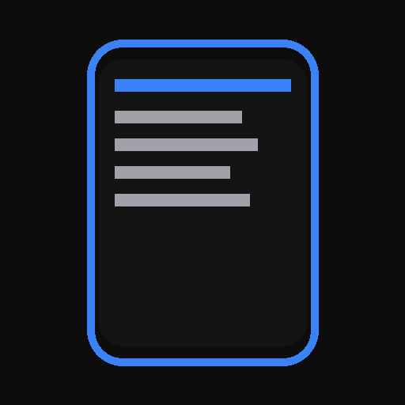
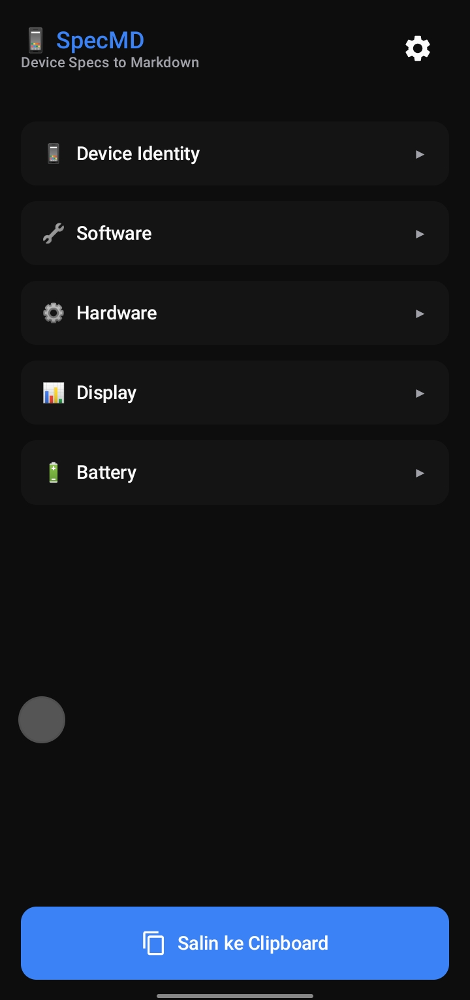

<p align="center">
  
</p>

<h1 align="center">SpecMD</h1>
<p align="center">
  <strong>One tap. Device specs to clean Markdown.</strong>
</p>

<p align="center">
  <a href="https://github.com/Curzyori/spec-md/tree/main/version"><strong>📦 Current Version Build</strong></a>
</p>

<div align="center">

[](https://github.com/Curzyori/spec-md/stargazers)
[](https://github.com/Curzyori/spec-md/network/members)
[](LICENSE)
[](#)

</div>

<p align="center">
  <a href="#-why-specmd">Why This</a> ·
  <a href="#-key-features">Features</a> ·
  <a href="#-installation">Installation</a> ·
  <a href="#-preview">Preview</a>
</p>

---

## 🕒 Why SpecMD?

Extract your Android device specifications and export them to clean Markdown format. Perfect for bug reports, tech reviews, forum posts, and seller listings.

|                               |                                                              |
| ----------------------------- | ------------------------------------------------------------ |
| ⚡ **One-Tap Copy**           | Copy formatted Markdown to clipboard instantly.               |
| 📁 **Save to File**           | Export as `.md` file to Downloads folder.                    |
| 📤 **Share Anywhere**         | Send to any app via Android share sheet.                     |
| 👁 **Live Preview**           | Preview Markdown before exporting.                           |
| 🌏 **Multi-Language**         | English and Bahasa Indonesia out of the box.                  |
| 🌙 **Dark Theme**             | Eye-friendly dark UI by default.                             |

---

## 🎯 Key Features

| Feature | Status | Description |
| :--- | :---: | :--- |
| **One-Tap Copy** | ✅ | Copy formatted Markdown to clipboard instantly. |
| **Save to File** | ✅ | Export as `.md` file to Downloads folder. |
| **Share** | ✅ | Send to any app via Android share sheet. |
| **Preview** | ✅ | Preview Markdown before exporting. |
| **Bilingual** | ✅ | Toggle between English and Bahasa Indonesia. |
| **Dark Theme** | ✅ | Eye-friendly dark UI by default. |
| **No Ads** | ✅ | Clean, fast, no distractions. |

---

## 🛠 Tech Stack

- **Platform:** Android
- **Language:** Kotlin 2.0.0
- **UI Framework:** Jetpack Compose with Material Design 3
- **Min SDK:** 26 (Android 8.0)
- **Target SDK:** 35 (Android 15)
- **Architecture:** MVVM + Clean Architecture
- **DI:** Hilt
- **License:** Apache 2.0

---

## 📦 Installation

Download the latest APK from the [version folder](https://github.com/Curzyori/spec-md/tree/main/version):

| Version | File |
| :--- | :--- |
| v1.0.0 | `SpecMD-V1.0.0.apk` |

### Build from Source
```bash
git clone https://github.com/Curzyori/spec-md.git
cd spec-md
./gradlew assembleDebug
```

Output: `app/build/outputs/apk/debug/app-debug.apk`

---

## 🖼️ Preview

<p align="center">
  
</p>

---

## ☕ Support

If SpecMD is useful, consider supporting its development!

<p align="center">
  <a href="https://donate.curzy.dev/"><strong>💝 Donate via Crypto or QRIS</strong></a>
</p>

Crypto payment details are maintained at [donate.curzy.dev](https://donate.curzy.dev/).

---

## 📄 License

This project is released under the **Apache License 2.0** — see [LICENSE](LICENSE) for full text.

<sub>Built with passion as the 18th Project of the 50 Projects Challenge by **@Curzyori**</sub>
